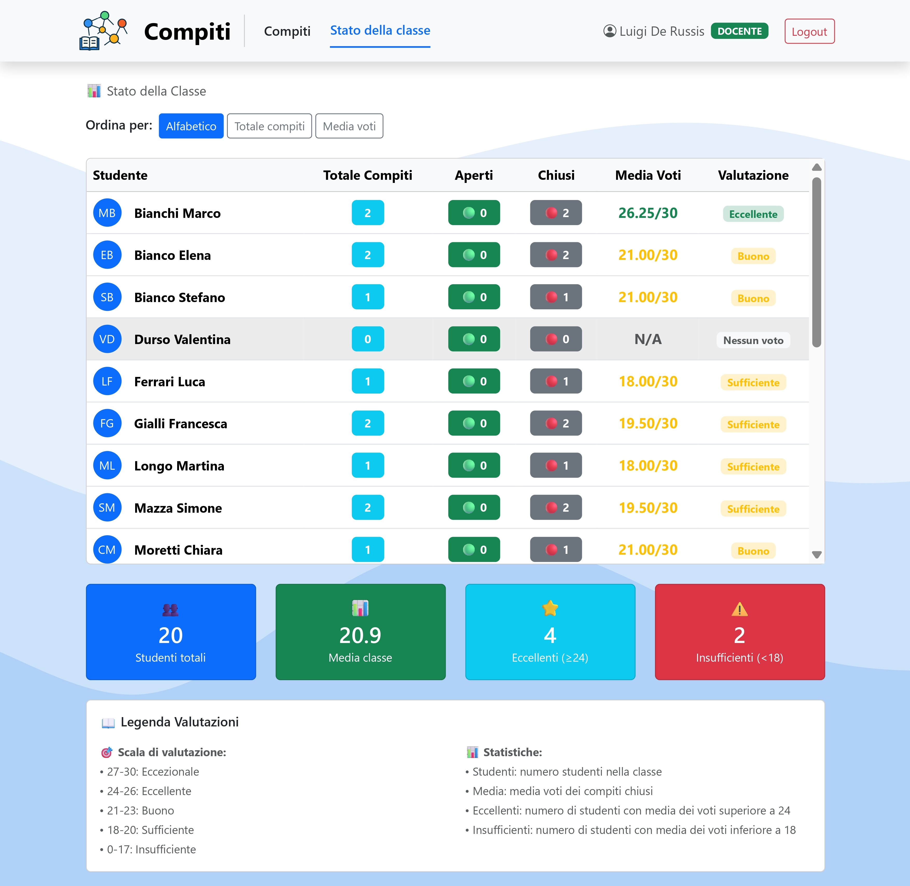

[](https://classroom.github.com/a/F9jR7G97)

# Exam #2: "Compiti"

## Student: s332938 ROSACE GIOVANNA

## React Client Application Routes

- Route `/`: homepage con un messaggio di benvenuto che invoglia all'azione. Reindirizza automaticamente gli utenti autentificati alla propria dashboard in base al ruolo, altrimenti indirizza al Login.
- Route `/login`: pagina di login con campo email e password per autentificarsi.
- Route `/docente/compiti`: dashboard docente che mostra tutti i compiti creati, con filtri e possibilità di creazione.
- Route `/docente/compiti/:id`: vista dettagliata di un compito specifico (id) per i docenti.
- Route `/docente/compiti/:id/valuta`: pagina per valutare le risposte degli studenti.
- Route `/docente/classe/stato`: medie dei voti della classe con la lista degli studenti e loro performance, con opzioni di ordinamento.
- Route `/studente/compiti`: dashboard studente con tutti i compiti assegnati, filtrabili anche per stato (aperto/chiuso).
- Route `/studente/compiti/:id`: vista dettagliata di un compito specifico (id) per studenti.
- Route `/studente/compiti/:id/rispondi`: pagina per rispondere o modificare la risposta del compito.
- Route `/studente/valutazioni`: pagina con i voti e le performance degli studenti.
- Route `*`: qualsiasi altra pagina non presente, viene gestita come un - 404 pagina non trovata

#### **Modal Routes (**Gestione Modali tramite Parametri URL**)**

Per la creazione dei compiti da parte del docente, sono stati utilizzati modali (in 2 step) con gestione dello stato basata su URL:

* Route `/docente/compiti?modal=crea`: modal creazione compito - appena aperto.
* Route `/docente/compiti?modal=crea&step=1`: modal creazione compito - Step 1 (inserimento domanda).
* Route `/docente/compiti?modal=crea&step=2`: modal creazione compito - Step 2 (selezione studenti del gruppo).

*Caratteristiche avanzate aggiunte*:

- Deep linking diretto ai modali: l'URL apre direttamente un modal specifico in un determinato stato.
- Persistenza stato durante refresh: lo stato del modale del primo step sopravvive al refresh della pagina, grazie alla combinazione di URL params e sessionStorage.
- Navigazione browser (pulsanti Indietro/Avanti) integrata.
- SessionStorage per dati temporanei del form: per salvare dati da non esporre nell'URL, ma che devono persistere in caso di errori nei vari step (domanda).

Queste caratteristiche avanzate sono state implementate per superare le limitazioni dei modali, rispetto all'uso di una normale pagina per la creazione di un compito.

## API Server

### Route di Autenticazione

**POST `/api/sessions`**

Descrizione: autentificare un utente nel sistema

- Request body:

```json
{ 
    "email": "luigi.derussis@polito.it", 
    "password": "prova123" 
} 
```

- Response: `200 OK` (success) o `401 Unauthorized` (credenziali non valide) o `500 Internal Server Error` (errore generico).
- Response body: oggetto utente

```json
{ 
    "id": 1, 
    "email": "luigi.derussis@polito.it", 
    "nome": "Luigi", 
    "cognome": "De Russis", 
    "ruolo": "docente" 
}
```

**DELETE `/api/sessions/current`**

Descrizione: effettuare il logout dell'utente corrente

- Response: 200 OK (success) o 500 Internal Server Error (errore generico).
- Response body: None

**GET `/api/sessions/current`**

Descrizione: ottenere le informazioni dell'utente attualmente autenticato

- Response: 200 OK (success) o 401 Unauthorized (non autenticato) o 500 Internal Server Error (errore generico).
- Response body:

```json
{
  "id": 1,
  "email": "luigi.derussis@polito.it",
  "nome": "Luigi",
  "cognome": "De Russis",
  "ruolo": "docente"
}
```

### Route per Docenti

**GET `/api/docente/classe`**

Descrizione: ottenere la lista di tutti gli studenti della classe

- Response: 200 OK (success) o 500 Internal Server Error (errore generico).
- Response body: array di studenti

```json
[
  {
    "id": 2,
    "nome": "Alice",
    "cognome": "Rossi"
  },
  //altri studenti
]
```

**POST `/api/docente/compiti`**

Descrizione: creare un nuovo compito assegnandolo a un gruppo di studenti

- Request body:

```json
{
  "traccia": "Come si passa un dato da un componente genitore a uno figlio?",
  "studentiIds": [2, 3, 4]
}
```

- Response: 201 Creato (success) o 200 OK (conflitto collaborazioni) o 400 Bad Request (dati non validi) o 500 Internal Server Error (errore generico).
- Response body:

```json
{
  "success": true,
  "data": {
    "id": 15,
    "creato_il": "2025-07-04 12:20:57"
  }
}
```

oppure, conflitto collaborazioni:

```json
{
  "success": false,
  "conflict": true,
  "error": "Gli studenti Alice Rossi e Francesca Gialli hanno già collaborato 2 volte. Il limite massimo di collaborazioni è stato superato.",
  "codice": "LIMITE_COLLABORAZIONI_SUPERATO"
}

```

**GET `/api/docente/classe/collaborazioni`**

Descrizione: ottenere le coppie di studenti con numero di collaborazioni >= minCount

- Parametri della richiesta: `minCount` (opzionale, default: 2)
- Response: 200 OK (success) o 500 Internal Server Error (errore generico).
- Response body:

```json
{
  "collaborazioni": ["2-3", "3-4", "4-5"]
}
```

(gli studenti con id 2 ed id 3 hanno collaborato due volte insieme ecc.)

**PUT `/api/docente/compiti/:id/valuta`**

Descrizione: valutare e chiudere un compito assegnando un punteggio

- Parametri della richiesta: `:id` (ID del compito)
- Request body:

```json
{
  "punteggio": 25,
  "ultimaModificaRisposta": "2025-07-04 12:30:57"
}
```

- Response: 200 OK (success o conflitto) o 404 Not Found (compito non trovato) o 400 Bad Request (errore validazione) o 500 Internal Server Error (errore generico).
- Response body:

```json
{
  "success": true,
  "data": 25
}
```

oppure, conflitto compito già chiuso:

```json
{
  "success": false,
  "conflict": true,
  "error": "Il compito è già stato chiuso e non può essere più valutato",
  "codice": "COMPITO_CHIUSO"
}
```

oppure, conflitto risposta modificata:

```json
{
  "success": false,
  "conflict": true,
  "error": "La risposta è stata modificata durante la valutazione. Ricarica la pagina per vedere la nuova risposta.",
  "codice": "RISPOSTA_MODIFICATA"
}
```

**GET `/api/docente/classe/stato`**

Descrizione: ottenere le statistiche della classe con voti e performance degli studenti

- Parametri della richiesta: `sort` (opzionale: "media", "alfabetico", "totale")
- Response: 200 OK (success) o 500 Internal Server Error (errore generico).
- Response body:

```json
{
  "ordinamento": "alfabetico",
  "studenti": [
    {
      "studente": {
        "id": 2,
        "nome": "Alice",
        "cognome": "Rossi"
      },
      "totale_compiti": 5,
      "compiti_aperti": 1,
      "compiti_chiusi": 4,
      "media": 24.5
    },
    // ... altri studenti 
  ]
}
```

**GET `/api/docente/compiti`**

Descrizione: visualizzare tutti i compiti creati dal docente, con relative informazioni utili

- Response: 200 OK (success) o 500 Internal Server Error (errore generico).
- Response body:

```json
{
  "totale": 10,
  "compiti": [
    {
      "id": 15,
      "traccia": "Come si passa un dato da un componente genitore a uno figlio?",
      "stato": "chiuso",
      "creato_il": "2025-07-04 12:20:57",
      "chiuso_il": "2025-07-02 16:45:00",
      "numero_studenti": 3,
      "gruppo": [
        {
          "id": 2,
          "nome": "Alice",
          "cognome": "Rossi"
        },
        //altri studenti
      ],
      "ha_risposta": true,
      "punteggio": 25
    },
    //altri compiti
  ]
}
```

**GET `/api/docente/compiti/:id`**

Descrizione: visualizzare i dettagli di un compito specifico

- Parametri della richiesta: `:id` (ID del compito)
- Response: 200 OK (success) o 404 Not Found (compito non trovato) o 403 Forbidden (non autorizzato) o 500 Internal Server Error (errore generico).
- Response body:

```json
{
  "id": 15,
  "traccia": "Come si passa un dato da un componente genitore a uno figlio?",
  "stato": "chiuso",
  "creato_il": "2025-07-04 12:20:57",
  "chiuso_il": "2025-07-02 16:45:00",
  "numero_studenti": 3,
  "gruppo": [
    {
      "id": 2,
      "nome": "Alice",
      "cognome": "Rossi"
    }
  ],
  "risposta": {
    "testo": "Bella domanda!",
    "aggiornato_il": "2025-07-02 15:30:00",
    "inviato_da": {
      "id": 2,
      "nome": "Alice",
      "cognome": "Rossi"
    }
  },
  "punteggio": 25
}
```

### Route per Studenti

**GET `/api/studente/compiti`**

Descrizione: visualizzare tutti i compiti assegnati allo studente

- Parametri della richiesta: `stato` (opzionale: "aperto", "chiuso")
- Response: 200 OK (success) o 500 Internal Server Error (errore generico).
- Response body:

```json
{
  "filtro": "tutti",
  "totale": 8,
  "compiti": [
    {
      "id": 15,
      "traccia": "Come si passa un dato da un componente genitore a uno figlio?",
      "stato": "chiuso",
      "creato_il": "2025-07-04 12:20:57",
      "chiuso_il": "2025-07-02 16:45:00",
      "docente": {
        "id": 1,
        "nome": "Luigi",
        "cognome": "De Russis"
      },
      "gruppo": [
        {
          "id": 2,
          "nome": "Alice",
          "cognome": "Rossi"
        },
        //altri studenti
      ],
      "ha_risposta": true,
      "punteggio": 25,
      "numero_studenti": 2
    },
    //altri compiti
  ]
}
```

**PUT `/api/studente/compiti/:id/rispondi`**

Descrizione: inserire o aggiornare la risposta a un compito

- Parametri della richiesta: `:id` (ID del compito)
- Request body:

```json
{
  "testo_risposta": "Come si passa un dato da un componente genitore a uno figlio?",
  "ultimaModificaRisposta": "2025-07-04 15:30:00"
}
```

- Response: 200 OK (success o conflitto) o 404 Not Found (compito non trovato) o 403 Forbidden (non autorizzato) o 422 Unprocessable Entity (validation error) o 500 Internal Server Error (errore generico).
- Response body:

```json
{
  "success": true,
  "data": {
    "aggiornato_il": "2025-07-04 15:31:00",
    "compito_id": 15,
    "testo_risposta": "Bella domanda!"
  }
}
```

oppure, conflitto compito chiuso:

```json
{
  "success": false,
  "conflict": true,
  "error": "Il compito è già stato chiuso e non può essere più modificato",
  "codice": "COMPITO_CHIUSO_STUDENTE"
}
```

oppure, conflitto risposta modificata da un altro membro:

```json
{
  "success": false,
  "conflict": true,
  "error": "La risposta è stata modificata da un altro membro del gruppo mentre stavi scrivendo.",
  "codice": "RISPOSTA_MODIFICATA_STUDENTE",
  "dettagli": {
    "modificataDa": {
      "id": 3,
      "nome": "Alice",
      "cognome": "Rossi"
    },
    "tuaRisposta": "Dai rispondiamo...",
    "rispostaCorrente": "Bella domanda!",
    "ultimaModifica": "2025-07-04 13:21:10"
  }
}
```

**GET `/api/studente/media`**

Descrizione: ottenere la media dei voti del singolo studente e il totale dei compiti

- Response: 200 OK (success) o 500 Internal Server Error (errore generico).
- Response body:

```json
{
  "totale_compiti": 5,
  "media": 24.2
}
```

**GET `/api/studente/compiti/:id`**

Descrizione: visualizzare i dettagli di un compito specifico

- Parametri della richiesta: `:id` (ID del compito)
- Response: 200 OK (success) o 404 Not Found (compito non trovato) o 403 Forbidden (non autorizzato) o 500 Internal Server Error (errore generico).
- Response body:

```json
{
  "id": 15,
  "traccia": "Come si passa un dato da un componente genitore a uno figlio?",
  "stato": "aperto",
  "creato_il": "2025-07-04 12:20:57",
  "chiuso_il": null,
  "docente": {
    "id": 1,
    "nome": "Luigi",
    "cognome": "De Russis"
  },
  "gruppo": [
    {
      "id": 2,
      "nome": "Alice",
      "cognome": "Rossi"
    },
    //altri studenti
  ],
  "numero_studenti": 2,
  "risposta": {
    "testo": "Bella domanda!",
    "aggiornato_il": "2025-07-04 15:15:00",
    "inviato_da": {
      "id": 2,
      "nome": "Alice",
      "cognome": "Rossi"
    }
  },
  "punteggio": null
}
```

## Database Tables

* **Tabella `utenti`** – Contiene le informazioni degli utenti: id, email, password, salt, nome, cognome, ruolo (docente/studente)
* **Tabella `compiti`** – Contiene i compiti: id, traccia, creato_da, stato, numero_studenti, punteggio, creato_il, chiuso_il
* **Tabella `assegnazioni_compiti`** – Relazione compito-studente: id, compito_id, studente_id
* **Tabella `risposte_compiti`** – Contiene le risposte degli studenti: id, compito_id, testo_risposta, inviato_da, aggiornato_il

## Main React Components

- [`DocenteDashboard`](client/src/components/pages/docente/DocenteDashboard.jsx): pagina principale per la gestione dei compiti da parte del docente autentificato. Consente di navigare al dettaglio o alla valutazione dei compiti. Gestisce le conferme di successo per le operazioni e i vari handle di controllo per CreaCompito.
- [`CreaCompito`](client/src/components/modals/CreaCompito.jsx): modale a più step per creare compiti con input della traccia e selezione degli studenti, con evidenziazione visuale del limite delle collaborazioni. Incluso inoltre il rilevamento dei conflitti di collaborazione, persistenza temporanea della traccia della domanda, gestione dello stato basato su URL e transizioni animate tra gli step.
- [`StudenteDashboard`](client/src/components/pages/studente/StudenteDashboard.jsx): pagina principale per la gestione dei compiti da parte dello studente autetificato. Consente di navigare al dettaglio o rispondere direttamente ai compiti. Gestisce le conferme di successo per le varie operazioni.
- [`RisoluzioneConflitti`](client/src/components/utils/RisoluzioneConflitti.jsx): gestione dei conflitti per le risposte modificate contemporaneamente dagli studenti, consente la scelta della versione da mantenere.
- [`ListaCompiti`](client/src/components/ListaCompiti.jsx): componente riutilizzabile per docenti e studenti, mostra l'elenco dei compiti in formato tabellare con filtri, azioni e funzionalità basate sul ruolo.
- [`AuthContext`](client/src/AuthContext.jsx): uso di un contesto per la gestione globale dell'autentificazione, evitando prop drilling.

## Screenshot

##### Crea compito:


##### Stato della classe:



## Users Credentials

Per semplicità si riportano le credenziali di uno dei due docenti e di uno solo dei 20 studenti.

###### DOCENTE:

- Email: luigi.derussis@polito.it  - Password: prova123

###### STUDENTE:

- Email: alice.rossi@studenti.polito.it  - Password: prova123
